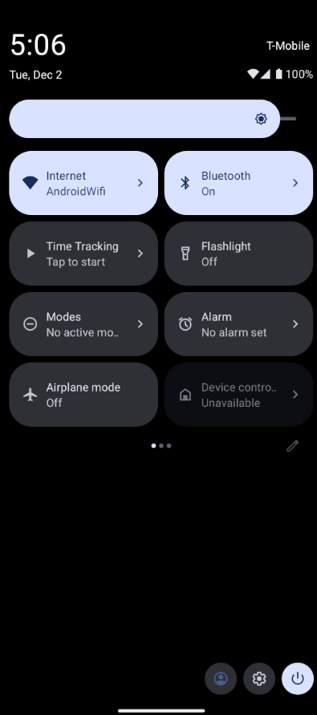
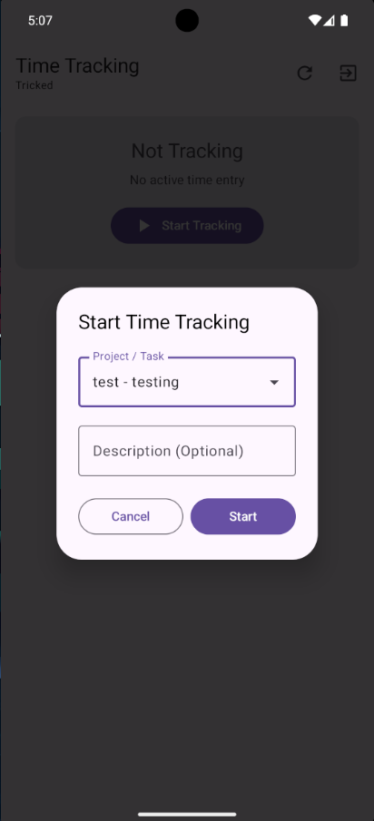
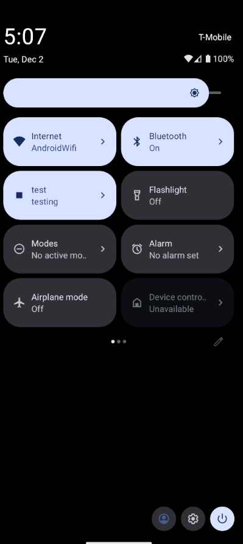

# SolidVerdant

[](https://github.com/Tricked-dev/SolidVerdant/releases/tag/nightly)
[](https://github.com/Tricked-dev/SolidVerdant/releases/download/nightly/app-release.apk)

Direct Download


<p align="center">
  <strong>Modern Android time tracking client for Solidtime</strong>
</p>

<p align="center">
  A native Kotlin/Jetpack Compose Android application that connects to <a href="https://www.solidtime.io/">Solidtime</a> for secure, OAuth2-based time tracking on mobile devices.
</p>

---

## Features

- **OAuth2 Authentication with PKCE** - Secure authentication flow with Proof Key for Code Exchange
- **Real-time Tracking Display** - View your current time entry with live elapsed time counter
- **Material 3 Design** - Modern, beautiful UI following Material Design 3 guidelines
- **Automatic Token Refresh** - Seamless session management without manual re-authentication
- **Custom Server Support** - Configure custom Solidtime server endpoints
- **Encrypted Storage** - Secure token storage using Android DataStore
- **Offline-First Architecture** - Clean architecture with reactive state management

## Quirks

- State of tile will not sync correctly with what is online unless you have the application open, this is not a problem if you exclusively use the tile and app instead of using the website & desktop app.

## Screenshots

<p align="center">
  
  
  
</p>

<p align="center">
  <em>Login Screen • Time Tracking • Configuration</em>
</p>

## Tech Stack

### Core Technologies
- **Language**: Kotlin
- **UI Framework**: Jetpack Compose with Material 3
- **Architecture**: MVVM with Clean Architecture
- **Dependency Injection**: Hilt
- **Networking**: Retrofit + OkHttp
- **Serialization**: Kotlinx Serialization
- **Async**: Kotlin Coroutines + Flow
- **Storage**: DataStore Preferences

### Key Libraries
- **Jetpack Compose** - Declarative UI framework
- **Hilt** - Dependency injection
- **Retrofit** - Type-safe HTTP client
- **OkHttp** - HTTP interceptors and authentication
- **Kotlinx Serialization** - JSON serialization
- **DataStore** - Encrypted preference storage
- **Custom Tabs** - Secure OAuth browser flow
- **Timber** - Logging

### Configuration

By default, SolidVerdant connects to the official Solidtime instance at `https://app.solidtime.io`. To configure a custom server:

1. Launch the app
2. On the login screen, tap the settings icon (⚙️) in the top bar
3. Enter your custom server endpoint and OAuth client ID
4. Tap "Save"

**Default Configuration:**
- **Server Endpoint**: `https://app.solidtime.io`
- **Client ID**: `9c994748-c593-4a6d-951b-6849c829bc4e`

#### Selfhosted

run `docker exec solidtime-scheduler php artisan passport:client --name=desktop --redirect_uri=solidtime://oauth/callback --public -n`

## Usage

Goal of this application is to have a easy to use tile to start and stop tracking, this application does everything i need it to but pullrequests for other features are welcome, forking is fine too

1. **Login**: Tap "Login with OAuth2" to authenticate via your Solidtime account
2. **View Tracking**: See your current time entry with live elapsed time
3. **Refresh**: Pull to refresh or tap the refresh button to update tracking state
4. **Logout**: Tap logout to clear all data and return to login screen

## Building for Production

### Debug Build
```bash
./gradlew assembleDebug
   ```

### Build Variants

- **Debug** (`app-debug.apk`) - Includes logging, no minification, package suffix `.dev`
- **Release** (`app-release.apk`) - ProGuard enabled, resources shrunk, signed for distribution

## Testing

Run unit tests:
```bash
./gradlew test
```

Run instrumentation tests:
```bash
./gradlew connectedAndroidTest
```

## Security

SolidVerdant implements enterprise-grade security features:

- **PKCE (Proof Key for Code Exchange)**: Prevents authorization code interception attacks
- **State Parameter Validation**: CSRF protection for OAuth flow
- **Encrypted Token Storage**: Secure storage using Android DataStore
- **Automatic Token Rotation**: Tokens refreshed securely on expiration
- **Custom Tabs**: OAuth flows handled in secure, isolated browser context

## Links

- **Solidtime Website**: [https://www.solidtime.io/](https://www.solidtime.io/)
- **Solidtime Web App**: [https://app.solidtime.io](https://app.solidtime.io)

## Acknowledgments

- Built with [Jetpack Compose](https://developer.android.com/jetpack/compose)
- Architecture patterns from [Android Architecture Samples](https://github.com/android/architecture-samples)

---

<p align="center">
  Made with ❤️ (and almost entirely Claude) for the Solidtime community
</p>
