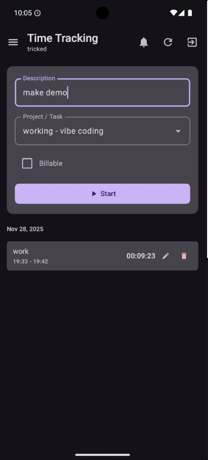
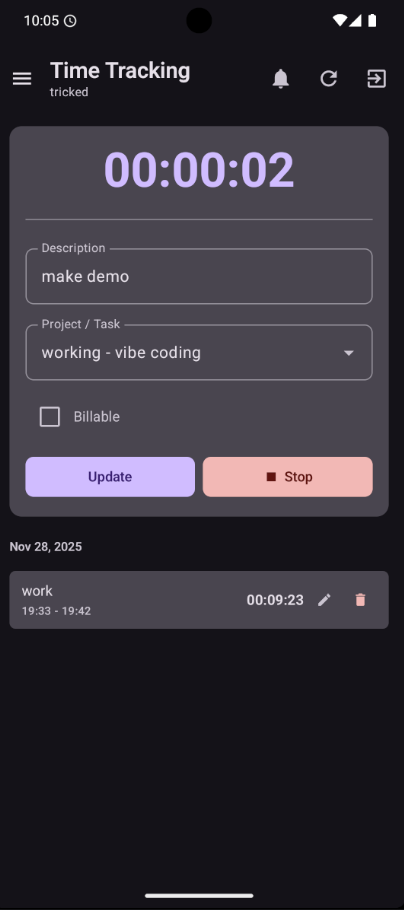
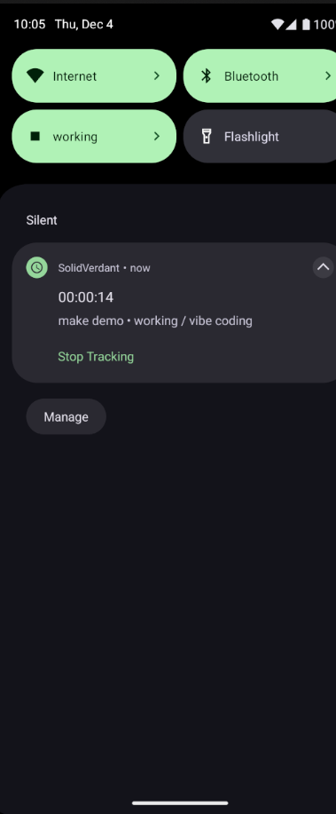

# SolidVerdant

[](https://github.com/Tricked-dev/SolidVerdant/releases/tag/nightly)
[](https://github.com/Tricked-dev/SolidVerdant/releases/download/nightly/app-release.apk)
[](https://apps.obtainium.imranr.dev/redirect.html?r=obtainium://app/%7B%22id%22%3A%22dev.tricked.solidverdant%22%2C%22url%22%3A%22https%3A%2F%2Fgithub.com%2FTricked-dev%2FSolidVerdant%22%2C%22author%22%3A%22Tricked-dev%22%2C%22name%22%3A%22SolidVerdant%22%2C%22additionalSettings%22%3A%22%7B%5C%22includePrereleases%5C%22%3Atrue%2C%5C%22fallbackToOlderReleases%5C%22%3Atrue%2C%5C%22autoApkFilterByArch%5C%22%3Atrue%7D%22%7D)

<p align="center">
  <strong>Modern Android time tracking client for Solidtime</strong>
</p>

<p align="center">
  A native Kotlin/Jetpack Compose Android application that connects to <a href="https://www.solidtime.io/">Solidtime</a> for secure, OAuth2-based time tracking on mobile devices.
</p>

---

## Features

### Time tracking

- Start/stop time entries with a live elapsed timer
- Select projects and tasks from searchable dropdowns
- Add descriptions
- Edit or delete past time entries
- View history grouped by date, with identical entries collapsed into expandable groups
- Pull-to-refresh to sync with the server

### Android integration

- **Quick Settings tile** - Start/stop tracking without opening the app, with project selection dialog
- **Persistent notification** - Shows elapsed time with a chronometer and a stop button; optionally stays visible when idle
- **Boot persistence** - Restores notification state after reboot

### Auth and configuration

- OAuth2 with PKCE (no API keys needed)
- Automatic token refresh
- Custom server endpoints and OAuth client IDs
- Encrypted token storage

### UI

- Material 3 with Material You dynamic colors (Android 12+)
- Dark and light themes follow system settings
- Edge-to-edge display with predictive back gesture support (Android 13+)
- Available in English, Dutch, and Japanese + any language you want if you create a pull request

## Quirks

- The Quick Settings tile state won't sync with changes made on the web or desktop unless the app is open. Not a problem if you only use the tile and app.

## Screenshots

<p align="center">
  
  
  
</p>


<p align="center">
  
  
  
</p>


<p align="center">
  <em>Login Screen • Time Tracking • Configuration</em>
</p>

## Tech Stack

### Core Technologies
- **Language**: Kotlin
- **UI Framework**: Jetpack Compose with Material 3
- **Architecture**: MVVM with Clean Architecture
- **Dependency Injection**: Hilt
- **Networking**: Retrofit + OkHttp
- **Serialization**: Kotlinx Serialization
- **Async**: Kotlin Coroutines + Flow
- **Storage**: DataStore Preferences

### Key Libraries
- **Jetpack Compose** - Declarative UI framework
- **Hilt** - Dependency injection
- **Retrofit** - Type-safe HTTP client
- **OkHttp** - HTTP interceptors and authentication
- **Kotlinx Serialization** - JSON serialization
- **DataStore** - Encrypted preference storage
- **Custom Tabs** - Secure OAuth browser flow
- **Timber** - Logging

### Configuration

By default, SolidVerdant connects to the official Solidtime instance at `https://app.solidtime.io`. To configure a custom server:

1. Launch the app
2. On the login screen, tap the settings icon (⚙️) in the top bar
3. Enter your custom server endpoint and OAuth client ID
4. Tap "Save"

**Default Configuration:**
- **Server Endpoint**: `https://app.solidtime.io`
- **Client ID**: `9c994748-c593-4a6d-951b-6849c829bc4e`

#### Selfhosted

run `docker exec solidtime-scheduler php artisan passport:client --name=desktop --redirect_uri=solidtime://oauth/callback --public -n`

## Usage

Goal of this application is to have a easy to use tile to start and stop tracking, this application does everything i need it to but pullrequests for other features are welcome, forking is fine too

1. **Login**: Tap "Login with OAuth2" to authenticate via your Solidtime account
2. **View Tracking**: See your current time entry with live elapsed time
3. **Refresh**: Pull to refresh or tap the refresh button to update tracking state
4. **Logout**: Tap logout to clear all data and return to login screen

## Building for Production

### Debug Build
```bash
./gradlew assembleDebug
   ```

### Build Variants

- **Debug** (`app-debug.apk`) - Includes logging, no minification, package suffix `.dev`
- **Release** (`app-release.apk`) - ProGuard enabled, resources shrunk, signed for distribution

## Testing

Run unit tests:
```bash
./gradlew test
```

Run instrumentation tests:
```bash
./gradlew connectedAndroidTest
```
## Verification

You can verify the authenticity of SolidVerdant APKs using the signing certificate hash below. This works with [AppVerifier](https://github.com/soupslurpr/AppVerifier) or [Obtainium](https://github.com/ImranR98/Obtainium)'s built-in verification.

| Field | Value |
|-------|-------|
| **Package ID** | `dev.tricked.solidverdant` |
| **SHA-256 Signing Certificate** | `7A:38:2F:E9:14:1B:D3:DC:A4:C4:82:20:7F:FF:12:5A:82:8D:66:92:C4:0E:5A:BC:30:61:6C:33:15:C7:F3:64` |

You can also view this information in-app via **Settings > About > Verification Info**.

## Links

- **Solidtime Website**: [https://www.solidtime.io/](https://www.solidtime.io/)
- **Solidtime Web App**: [https://app.solidtime.io](https://app.solidtime.io)

## Acknowledgments

- Built with [Jetpack Compose](https://developer.android.com/jetpack/compose)
- Architecture patterns from [Android Architecture Samples](https://github.com/android/architecture-samples)

---

<p align="center">
  Made with ❤️ (and almost entirely Claude) for the Solidtime community
</p>
