# SolidVerdant

[](https://github.com/Tricked-dev/SolidVerdant/releases/tag/nightly)
[](https://github.com/Tricked-dev/SolidVerdant/releases/download/nightly/app-release.apk)
[](https://apps.obtainium.imranr.dev/redirect.html?r=obtainium://app/%7B%22id%22%3A%22dev.tricked.solidverdant%22%2C%22url%22%3A%22https%3A%2F%2Fgithub.com%2FTricked-dev%2FSolidVerdant%22%2C%22author%22%3A%22Tricked-dev%22%2C%22name%22%3A%22SolidVerdant%22%2C%22additionalSettings%22%3A%22%7B%5C%22includePrereleases%5C%22%3Atrue%2C%5C%22fallbackToOlderReleases%5C%22%3Atrue%2C%5C%22autoApkFilterByArch%5C%22%3Atrue%7D%22%7D)

<p align="center">
  <strong>Modern Android time tracking client for Solidtime</strong>
</p>

<p align="center">
  A native Kotlin/Jetpack Compose Android application that connects to <a href="https://www.solidtime.io/">Solidtime</a> for secure, OAuth2-based time tracking on mobile devices.
</p>

---

## Features

### Time tracking

- Start/stop time entries with a live elapsed timer
- Pause and resume active timers
- Select projects and tasks from searchable dropdowns
- Add descriptions, tags, and billable status
- Continue the most recent completed entry
- Edit or delete past time entries
- View history grouped by date, with identical entries collapsed into expandable groups
- Pull-to-refresh to sync with the server
- Switch between all organizations available to your Solidtime account

### Android integration

- **Quick Settings tile** - Start/stop tracking without opening the app, with project and task selection
- **Persistent notification** - Shows elapsed time with pause and stop controls
- **Notification quick start** - Start a timer with project, task, and description selection directly from the idle notification
- **Home-screen widget** - View tracking state and access quick controls
- **Boot persistence** - Restores notification state after reboot

### Auth and configuration

- OAuth2 with PKCE (no API keys needed)
- Automatic token refresh
- Custom server endpoints and OAuth client IDs
- Server details available in the settings drawer with tap-to-copy
- Encrypted token storage

### UI

- Material 3 with Material You dynamic colors (Android 12+)
- Dark and light themes follow system settings
- Edge-to-edge display with predictive back gesture support (Android 13+)
- Available in English, Dutch, and Japanese + any language you want if you create a pull request

## Quirks

- The Quick Settings tile state won't sync with changes made on the web or desktop unless the app is open. Not a problem if you only use the tile and app.

## Screenshots

The shots below are generated on the JVM (no device) by the Roborazzi + Robolectric suite — see
[Testing](#testing). Run `./gradlew :app:recordRoborazziDebug` to regenerate them.

<table>
  <tr>
    <td align="center">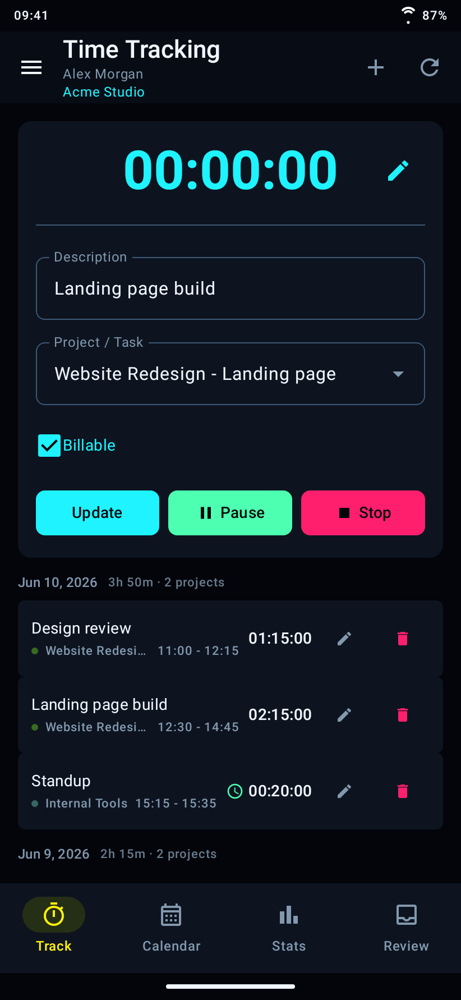<br /><sub><b>Track</b><br />Running timer &amp; history</sub></td>
    <td align="center">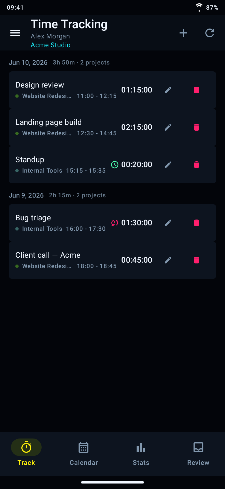<br /><sub><b>History</b><br />Entries grouped by day</sub></td>
    <td align="center">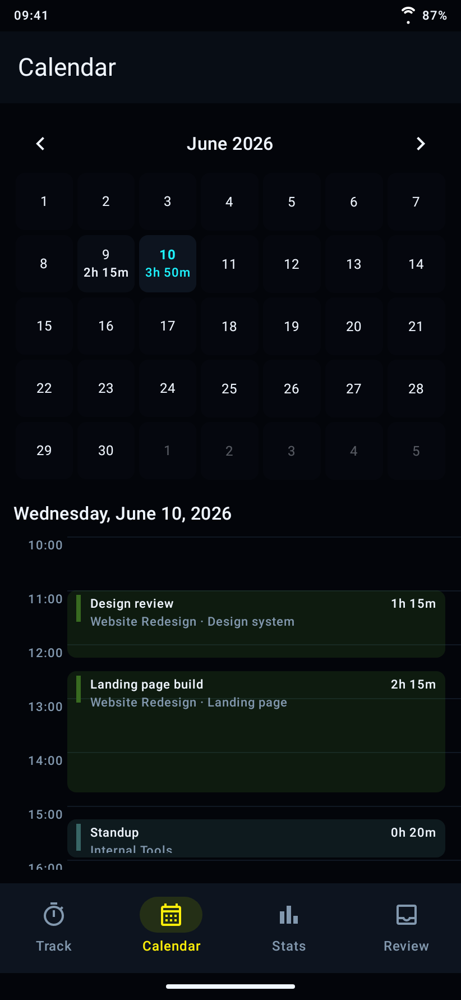<br /><sub><b>Calendar — Month</b><br />Month overview</sub></td>
  </tr>
  <tr>
    <td align="center">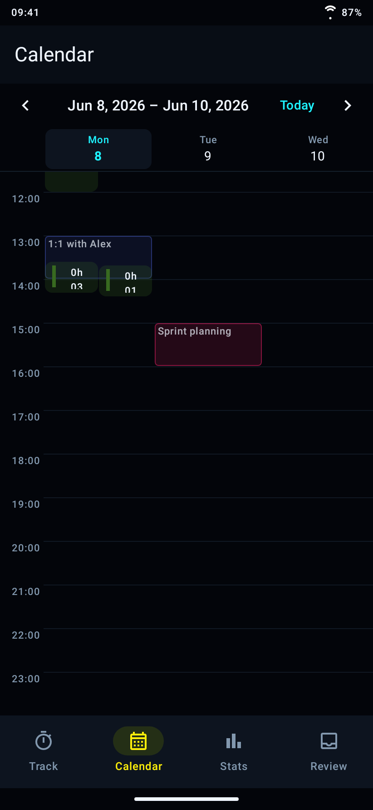<br /><sub><b>Calendar — Week</b><br />Week with calendar overlay</sub></td>
    <td align="center">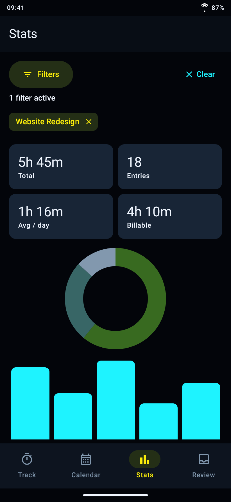<br /><sub><b>Statistics</b><br />KPIs, filters &amp; charts</sub></td>
    <td align="center">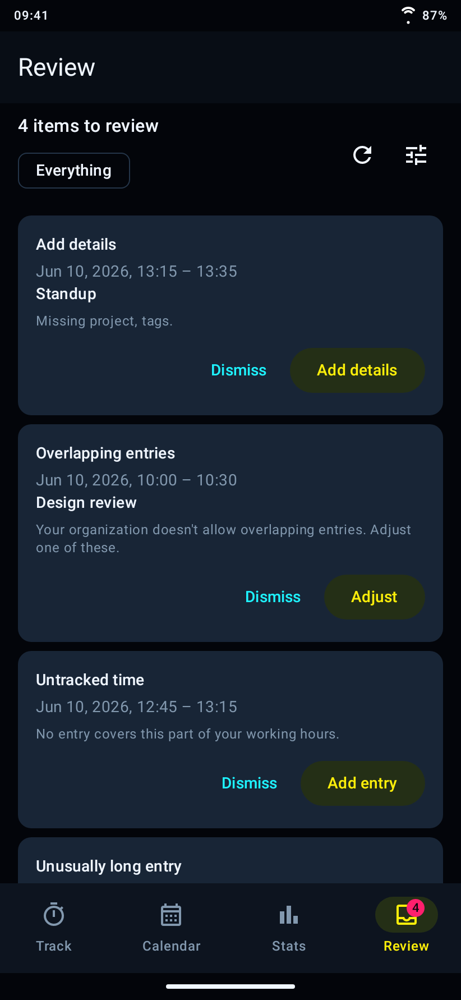<br /><sub><b>Time Inbox</b><br />Review issue cards</sub></td>
  </tr>
  <tr>
    <td align="center">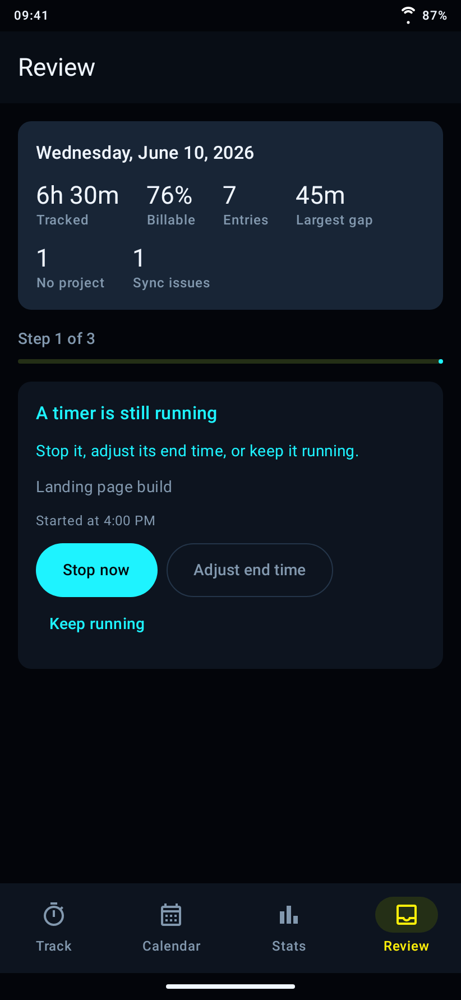<br /><sub><b>End-of-day Review</b><br />Guided cleanup</sub></td>
    <td align="center">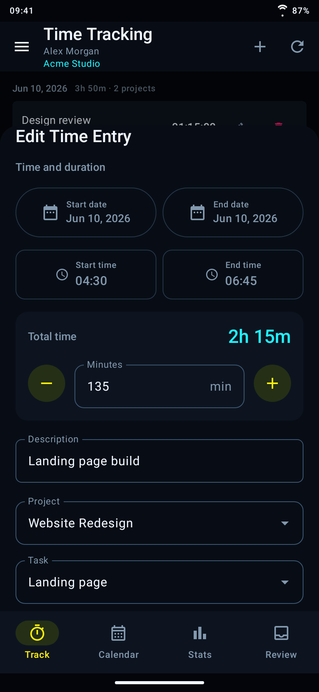<br /><sub><b>Edit Entry</b><br />Create / edit sheet</sub></td>
    <td align="center">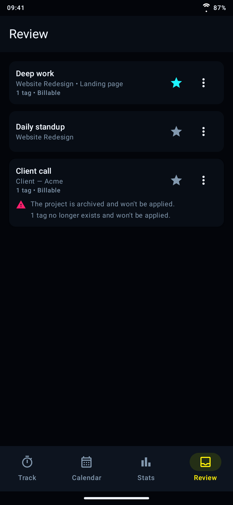<br /><sub><b>Templates</b><br />Favorites &amp; quick starts</sub></td>
  </tr>
</table>

<p align="center">
  <em>Rendered in the Neo dark theme.</em>
</p>

The Live activity shots below were captured on a connected Android 16 device.

<p align="center">
  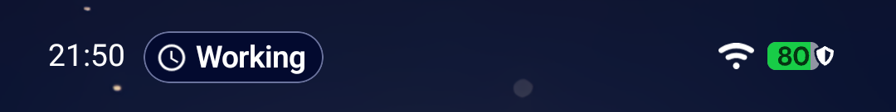<br />
  <sub><b>Live activity</b><br />Promoted ongoing notification while tracking</sub>
</p>

<p align="center">
  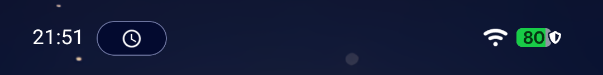<br />
  <sub><b>Compact live activity</b><br />Collapsed status bar presentation</sub>
</p>

## Tech Stack

### Core Technologies
- **Language**: Kotlin
- **UI Framework**: Jetpack Compose with Material 3
- **Architecture**: MVVM with Clean Architecture
- **Dependency Injection**: Hilt
- **Networking**: Retrofit + OkHttp
- **Serialization**: Kotlinx Serialization
- **Async**: Kotlin Coroutines + Flow
- **Storage**: DataStore Preferences with Android Keystore-backed AES-GCM encryption for OAuth secrets

### Key Libraries
- **Jetpack Compose** - Declarative UI framework
- **Hilt** - Dependency injection
- **Retrofit** - Type-safe HTTP client
- **OkHttp** - HTTP interceptors and authentication
- **Kotlinx Serialization** - JSON serialization
- **DataStore + Android Keystore** - Tokens and transient PKCE values are encrypted with AES-GCM; non-secret app settings remain ordinary preferences
- **Custom Tabs** - Secure OAuth browser flow
- **Timber** - Logging

### Configuration

By default, SolidVerdant connects to the official Solidtime instance at `https://app.solidtime.io`. To configure a custom server:

1. Launch the app
2. On the login screen, tap the settings icon (⚙️) in the top bar
3. Enter your custom server endpoint and OAuth client ID
4. Tap "Save"

**Default Configuration:**
- **Server Endpoint**: `https://app.solidtime.io`
- **Client ID**: `9c994748-c593-4a6d-951b-6849c829bc4e`

#### Selfhosted

run `docker exec solidtime-scheduler php artisan passport:client --name=desktop --redirect_uri=solidtime://oauth/callback --public -n`

## Usage

Goal of this application is to have a easy to use tile to start and stop tracking, this application does everything i need it to but pullrequests for other features are welcome, forking is fine too

1. **Login**: Tap "Login with OAuth2" to authenticate via your Solidtime account
2. **View Tracking**: See your current time entry with live elapsed time
3. **Switch Organization**: Tap the organization name in the header while no timer is active
4. **Refresh**: Pull to refresh or tap the refresh button to update tracking state
5. **Logout**: Open the navigation drawer and tap logout to clear all data and return to login screen

## Building for Production

### Debug Build
```bash
./gradlew assembleDebug
   ```

### Build Variants

- **Debug** (`app-debug.apk`) - Includes logging, no minification, package suffix `.dev`
- **Release** (`app-release.apk`) - ProGuard enabled, resources shrunk, signed for distribution

## Testing

Run unit tests:
```bash
./gradlew test
```

Run instrumentation tests:
```bash
./gradlew connectedAndroidTest
```

Generate the README screenshots (pure JVM, no device/emulator — Roborazzi + Robolectric):
```bash
./gradlew :app:recordRoborazziDebug
```
This renders every screen across a light/dark × phone/tablet matrix into `.github/screenshots/generated/`
and writes the Neo-dark phone hero set to `.github/screenshots/readme/`.

### Device and live Solidtime tests

Use the pinned development environment for Android verification:

```bash
devenv tasks run android:gate
devenv tasks run android:gate:instrumentation
devenv tasks run android:e2e:mock
```

The host gate is device-free. The instrumentation gate mirrors the CI `connectedCheck` and requires
an already-connected emulator or Android device. The mock E2E task builds and installs the debug APKs
and runs the device suite against a deterministic local backend. Live-portable tests can be run against
an isolated local Solidtime server:

```bash
# macOS: start Apple's container runtime once per host boot/login.
container system start
# Optional when multiple physical devices are attached:
# export ANDROID_SERIAL=<serial from adb devices>
devenv tasks run solidtime:test
```

On macOS the pinned live-test tasks use Apple's `/usr/local/bin/container` CLI, not Docker
Desktop or Podman. The runtime must have the official `solidtime/solidtime:latest` and `postgres:15`
images available (the task pulls them when needed). Check the runtime with `container system status`,
inspect services with `container ls`, and read service output with
`container logs solidverdant-solidtime-api` or `container logs solidverdant-solidtime-db`. The PostgreSQL task stores
its cluster below `PGDATA` inside the named test volume because Apple's volume mount includes a
filesystem metadata directory at the mount root. Apple container networking does not provide the
Docker service-name route used by the upstream stack, so the task resolves PostgreSQL's reserved
container address and injects it into the API configuration for each reset.
The Apple published-port bridge is reset-prone for long-lived HTTP clients, so the task publishes
the API to a disposable Unix socket under `/tmp`, forwards it through a small PHP/Ruby bridge to
`127.0.0.1:18080`, and replaces any bridge recorded by the previous run before starting another.

The live task starts the official Solidtime container with disposable PostgreSQL data, resets its
test account, and runs only E2E tests marked `@BackendPortable`. It requires one authorized physical
Android device; emulator serials are rejected. Set `ANDROID_SERIAL` if more than one physical device
is connected. The task uses `adb reverse` and removes the temporary test session from the device
afterward, including after a failed test. Do not use a personal Solidtime account or print the
generated session file. The disposable API and database containers may remain available after the
task for diagnosis; remove them and the host bridge with
`devenv tasks run solidtime:clean-stale` when they are no longer needed.

The reset removes all time entries from the disposable account and seeds `Live Test Project`, `Live
Test Task`, and `Live Test Tag` for metadata-edit tests. It is also available explicitly with
`devenv tasks run solidtime:reset`. `devenv tasks run android:e2e` is the mock-suite alias, and
`devenv tasks run android:e2e:real` is the live-suite alias. The default container image is the
stable `solidtime/solidtime:latest`; set `SOLIDTIME_IMAGE_TAG=main` only for an intentional upstream
development compatibility run. The local API uses Solidtime's testing environment so the production
per-user request throttle does not turn a rapid isolated suite into a false failure.

If the container runtime reports a permission or machine-state error, run `container system status`
and start it with `container system start` before retrying. If a restricted development environment
cannot open the Gradle distribution lock, rerun the same pinned `devenv` task with the approved
elevated container/build permission. These errors are environment restrictions, not Solidtime test
results.
The task prints the raw instrumentation transcript (the task runner may buffer it until completion)
and succeeds only when the final JUnit result contains `OK (N tests)` with `N` greater than zero. It
exits nonzero for `FAILURES!!!`, an adb/runner failure, or a missing/empty summary. This explicit check
is required because Android's `am instrument` shell command can itself exit successfully after JUnit
failures. Use the printed failing test names and stacks for diagnosis; never infer a pass from only
the `devenv` wrapper's elapsed-time line.

## Verification

You can verify the authenticity of SolidVerdant APKs using the signing certificate hash below. This works with [AppVerifier](https://github.com/soupslurpr/AppVerifier) or [Obtainium](https://github.com/ImranR98/Obtainium)'s built-in verification.

| Field                           | Value                                                                                             |
| ------------------------------- | ------------------------------------------------------------------------------------------------- |
| **Package ID**                  | `dev.tricked.solidverdant`                                                                        |
| **SHA-256 Signing Certificate** | `7A:38:2F:E9:14:1B:D3:DC:A4:C4:82:20:7F:FF:12:5A:82:8D:66:92:C4:0E:5A:BC:30:61:6C:33:15:C7:F3:64` |

You can also view this information in-app via **Settings > About > Verification Info**.

## Links

- **Solidtime Website**: [https://www.solidtime.io/](https://www.solidtime.io/)
- **Solidtime Web App**: [https://app.solidtime.io](https://app.solidtime.io)

## Acknowledgments

- Built with [Jetpack Compose](https://developer.android.com/jetpack/compose)
- Architecture patterns from [Android Architecture Samples](https://github.com/android/architecture-samples)

---

<p align="center">
  Made with ❤️ (and almost entirely Codex) for the Solidtime community
</p>
